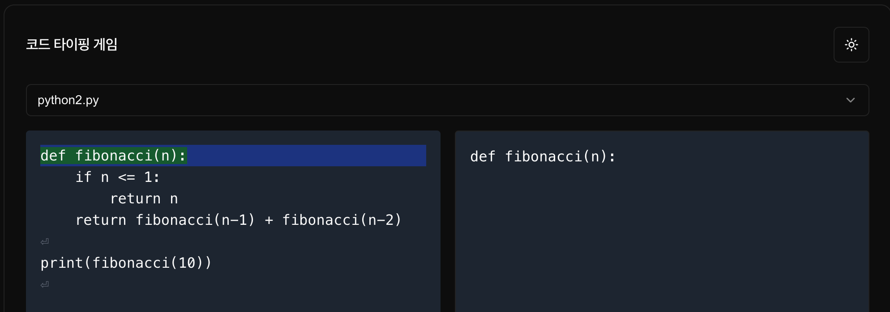

# Typing Game for Code



Claude를 활용해 Typing Game을 만들었습니다.  
다른 타이핑 게임에 새로운 프로그래밍 언어 및 코드를 추가하고 싶어서 만들었습니다.  
Claude 좋네요.

# feature
- dark mode
- typing result
- etc

## Getting Started

```bash
cd typing-game
npx shadcn@latest add card
npx shadcn@latest add select
npx shadcn@latest add alert-dialog
npx shadcn@latest add button
npm run dev
```

- sample code path: typing-game/code-samples
